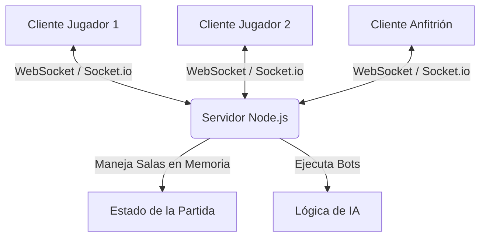

# Plan de Implementación: Catan Autoplay (Multijugador + IA)

Este documento detalla el plan técnico para construir un clon de Catan multijugador en tiempo real. Utilizaremos **React (Vite)** para el Frontend y **Node.js (Express + Socket.io)** para el Backend. Las salas se gestionarán de forma temporal en la memoria RAM del servidor (similar a Gartic Phone).

---

## Preguntas Abiertas (Para el Usuario)

> [!IMPORTANT]
> Por favor, revisa y responde a estas preguntas para ajustar el alcance del desarrollo:
>
> 1. **Complejidad de las Reglas (MVP):** ¿Prefieres que implementemos las reglas completas de Catan en la primera versión (comercio entre jugadores, el ladrón/puerto, cartas de desarrollo) o empezamos por una versión simplificada (tablero, tirada de dados, recolección de recursos, construcción de caminos/poblados/ciudades y la IA)?
> 2. **Estilo del Tablero:** ¿Prefieres un tablero hexagonal interactivo dibujado en 2D plano con SVG (muy limpio y responsivo) o un diseño con imágenes más estilizadas?
> 3. **Idioma del Juego:** ¿Quieres que todo el texto de la interfaz esté en Español?

---

## Arquitectura del Proyecto

Crearemos una estructura monorepo en la raíz del proyecto `Catan autoplay`:
- `client/`: Aplicación Frontend con React + Vite.
- `server/`: Servidor de Node.js + Socket.io.

---

## Cambios Propuestos

### Backend (Servidor)

#### [NEW] [package.json](file:///c:/Users/gasto/OneDrive/Desktop/Catan autoplay/server/package.json)
Configuración de dependencias del servidor: `express`, `socket.io`, `cors`, `nodemon`.

#### [NEW] [index.js](file:///c:/Users/gasto/OneDrive/Desktop/Catan autoplay/server/index.js)
Punto de entrada del servidor. Configuración del servidor Express, HTTP y Socket.io.

#### [NEW] [roomManager.js](file:///c:/Users/gasto/OneDrive/Desktop/Catan autoplay/server/roomManager.js)
Módulo para crear, unir y eliminar salas en memoria RAM. Manejará el ciclo de vida de los sockets.

#### [NEW] [gameLogic.js](file:///c:/Users/gasto/OneDrive/Desktop/Catan autoplay/server/gameLogic.js)
Lógica del estado de juego de Catan:
- Generación de tablero hexagonal (19 hexágonos, asignación de recursos y números de fichas).
- Gestión de turnos y fase de configuración inicial (colocación de primeros poblados/caminos).
- Simulación de dados y distribución de recursos.
- Validación de construcciones (caminos, poblados, ciudades).

#### [NEW] [botPlayer.js](file:///c:/Users/gasto/OneDrive/Desktop/Catan autoplay/server/botPlayer.js)
Lógica de la Inteligencia Artificial:
- Evaluar mejores posiciones para fundar poblados iniciales basados en probabilidades numéricas (frecuencia de los números del dado).
- Decidir qué construir en base a los recursos disponibles en su turno.
- Simular retardo en sus acciones para que parezca que piensa.

---

### Frontend (Cliente)

#### [NEW] [package.json](file:///c:/Users/gasto/OneDrive/Desktop/Catan autoplay/client/package.json)
Configuración del cliente React con Vite y dependencias como `socket.io-client` y librerías de diseño.

#### [NEW] [index.css](file:///c:/Users/gasto/OneDrive/Desktop/Catan autoplay/client/src/index.css)
Sistema de diseño premium: paleta de colores HSL (temática de Catan: trigos dorados, arcillas terracota, maderas forestales), tipografía moderna y variables de estilo.

#### [NEW] [Lobby.jsx](file:///c:/Users/gasto/OneDrive/Desktop/Catan autoplay/client/src/components/Lobby.jsx)
Pantalla de creación y unión a salas. 
- Muestra los jugadores conectados.
- Si el usuario es el host (dueño de la sala), muestra el botón **"Agregar IA"**.
- Permite iniciar la partida una vez que hay entre 3 y 4 participantes (humanos o IAs).

#### [NEW] [GameBoard.jsx](file:///c:/Users/gasto/OneDrive/Desktop/Catan autoplay/client/src/components/GameBoard.jsx)
Tablero interactivo usando SVG. Renderizará los hexágonos con sus respectivos recursos, fichas numéricas, caminos, poblados y ciudades de los jugadores en sus coordenadas correspondientes.

#### [NEW] [GamePanel.jsx](file:///c:/Users/gasto/OneDrive/Desktop/Catan autoplay/client/src/components/GamePanel.jsx)
Panel lateral que muestra:
- El turno actual.
- Los recursos de cada jugador en tiempo real.
- Botones de acción: Tirar Dados, Construir, Finalizar Turno.
- Registro de eventos (ej: "Jugador 1 tiró un 8 y recibió 2 de Madera").

---

## Plan de Verificación

### Pruebas Locales (Simulación de 4 jugadores)
1. Iniciaremos el servidor y el cliente localmente.
2. Abriremos varias pestañas del navegador en modo incógnito (`http://localhost:5173`).
3. Crearemos una sala con el primer jugador (Host).
4. Agregaremos 2 o 3 IAs usando el botón "Agregar IA".
5. Iniciaremos la partida y verificaremos:
   - Que los turnos se alternen correctamente entre humanos y bots.
   - Que los bots tomen decisiones autónomas (coloquen poblados iniciales, construyan cuando tengan recursos).
   - Que al desconectarse un jugador o cerrar la sala, la memoria del servidor libere el espacio correspondiente.
